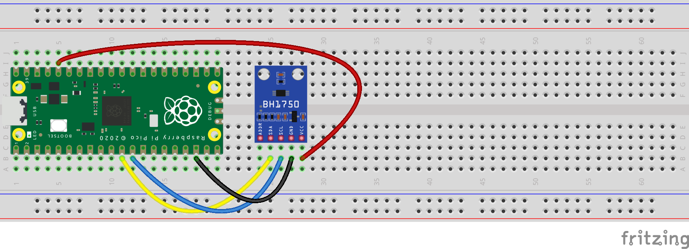

# pico-bh1750

This is a MicroPython library for the Raspberry Pi Pico and the 
[BH1750 digital Ambient Light Sensor](https://components101.com/sites/default/files/component_datasheet/BH1750.pdf).

## Example
```python
from machine import Pin, I2C
from utime import sleep

from bh1750 import BH1750

i2c0_sda = Pin(8)
i2c0_scl = Pin(9)
i2c0 = I2C(0, sda=i2c0_sda, scl=i2c0_scl)

bh1750 = BH1750(0x23, i2c0)

while True:
    print(bh1750.measurement)
    sleep(1)
```

This is the circuit for the example code above. It uses the 
[GY-302 BH1750](https://www.az-delivery.de/en/products/gy-302-bh1750-lichtsensor-lichtstaerke-modul-fuer-arduino-und-raspberry-pi) breakout board.



## Customizing configuration
By default, the BH1750 class uses the following settings:
- Measurement mode: 'one time' (it measures once and then shuts down, a next measurement automatically powers the 
  device back on and configures it again),
- Resolution: high (1 lx)
- Measurement time: 120 ms

These values can be changed via the `configure` method:
```python
bh1750.configure(BH1750.MEASUREMENT_MODE_CONTINUOUSLY,
                 BH1750.RESOLUTION_HIGH_2,
                 BH1750.MEASUREMENT_TIME_MAX)
```
The example above configures the BH1750 to measure continuously, use a higher resolution (0.5 lx) and the maximum
measurement time. Configuration can greatly affect the measurement time. The BH1750 class has a generator function that
attempts to calculate the correct 'sleep time' between measurements based on the chosen configuration:
```python
for measurement in bh1750.measurements():
    print(measurement)
```